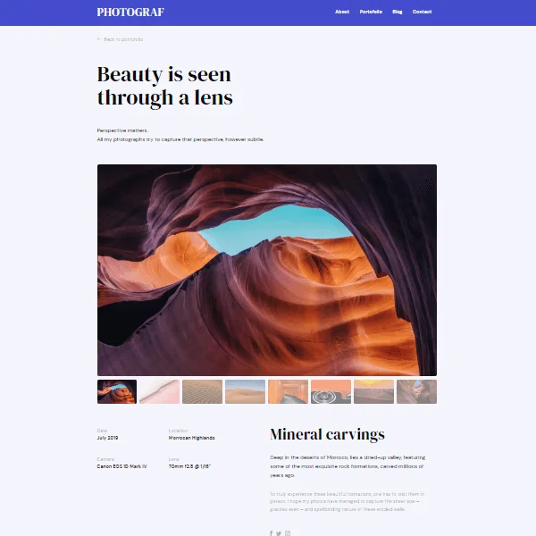

<h1 align="center">Photograf</h1>

<div align="center">
  <h3>
    <a href="https://voromahery.github.io/photograf/">
      Demo
    </a>
    <span> | </span>
    <a href="https://github.com/voromahery/photograf">
      Code
    </a>
  </h3>
</div>

<!-- TABLE OF CONTENTS -->

## Table of Contents

- [Overview](#overview)
  - [Built With](#built-with)
- [Features](#features)
- [How to use](#how-to-use)
- [Contact](#contact)
- [Acknowledgements](#acknowledgements)

<!-- OVERVIEW -->

## Overview

;

## [Acknowledgements](#acknowledgements)
A responsive website using Sass and HTML5 in order to practice Sass.

### Built With
- [Sass](https://sass-lang.com/)
- [CSS](https://developer.mozilla.org/en-US/docs/Web/CSS)
- [HTML](https://html.spec.whatwg.org/)
- [Javascript](https://www.javascript.com/)

## How To Use

We'll be using `node-sass` for our Sass compilation

- `npm i`

To compile the **Sass**, run the command below:

- `npm start`

```bash
# Clone this repository
$ git clone https://github.com/your-user-name/your-project-name

# Install dependencies
$ npm install

# Run the app
$ npm start
```

## Contact

- Email: Daniel.her@onja.org
- Phone: +2613791472
- GitHub [voromahery](https://github.com/voromahery/)
